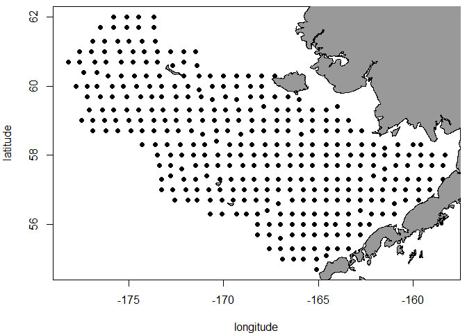
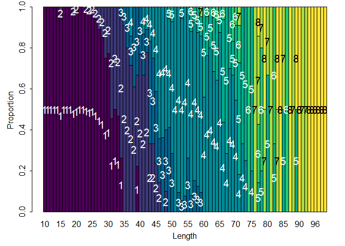
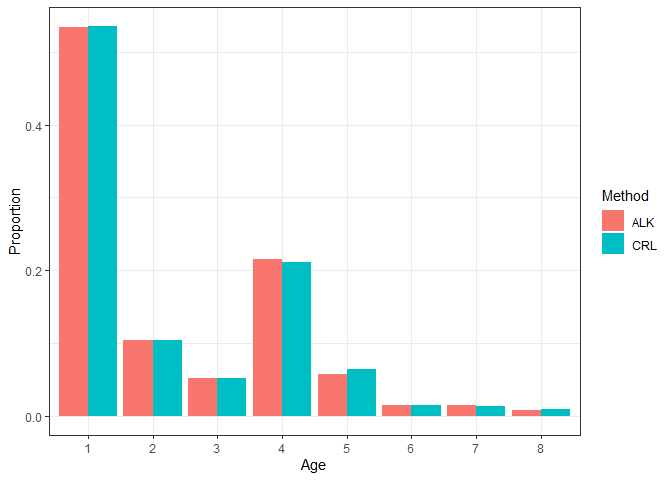

This is the code to run the analyses found in:

> Correa, G.M., Ciannelli, L., Barnett, L.A., Kotwicki, S., Fuentes, C., 2020. Improved estimation of age composition by accounting for spatiotemporal variability in somatic growth. Canadian Journal of Fisheries and Aquatic Sciences 77, 1810–1821. [https://doi.org/10.1139/cjfas-2020-0166](https://doi.org/10.1139/cjfas-2020-0166)

# Tutorial

This is a tutorial to estimate age compositions from fishery-independent
sources (e.g. survey) using classic age-length keys and continuation
ratio logits (Berg and Kristensen 2012). These two methods were
evaluated in a simulation experiment previously (Correa et al. 2020). Do
not hesitate to contact me if you have any question or ideas about how
to improve this tutorial.

I use these libraries:

``` r
library(ggplot2)
library(FSA)
library(dplyr)
library(maps)
library(mapdata)
library(devtools)
```

Data structure
--------------

I use simulated data based on the bottom-trawl survey design in the
eastern Bering Sea, which can be found
[here](https://github.com/gmoroncorrea/STageCompsEstimation/tree/master/sample_data).
The data have this structure, and I only select one year (2007) for this
example:

``` r
head(catch_data)
```

    ##      YEAR STATIONID    LON  LAT NUMBER_FISH
    ## 4538 2007       108 -165.1 54.7          38
    ## 4539 2007       230 -166.9 55.0          49
    ## 4540 2007       236 -166.3 55.0          36
    ## 4541 2007       241 -165.8 55.0          21
    ## 4542 2007       248 -165.1 55.0          19
    ## 4543 2007       310 -164.6 55.1          16

``` r
head(len_data)
```

    ##       YEAR STATIONID    LON  LAT LENGTH FREQUENCY
    ## 87039 2007       108 -165.1 54.7     17         3
    ## 87040 2007       108 -165.1 54.7     23         2
    ## 87041 2007       108 -165.1 54.7     24         2
    ## 87042 2007       108 -165.1 54.7     26         1
    ## 87043 2007       108 -165.1 54.7     28         4
    ## 87044 2007       108 -165.1 54.7     35         3

``` r
head(age_data)
```

    ##       YEAR STATIONID    LON  LAT LENGTH AGE
    ## 17264 2007       108 -165.1 54.7     17   1
    ## 17265 2007       108 -165.1 54.7     23   1
    ## 17266 2007       108 -165.1 54.7     61   4
    ## 17267 2007       108 -165.1 54.7     61   4
    ## 17268 2007       230 -166.9 55.0     53   3
    ## 17269 2007       230 -166.9 55.0     60   4

`catch_data` is the catch data, `len_data` is the length subsample data,
and the `age_data` is the age subsample data (each row represents a fish
sampled). The columns are:

-   `YEAR` is the sampling year
-   `STATIONID` is the station name or code where the sample was taken
-   `LON` and `LAT` are the longitude and latitude of the sampling
    station, respectively
-   `NUMBER_FISH` is the number of fish caught in the sampling station
-   `LENGTH` is the fish size
-   `FREQUENCY` is the fish size frequency
-   `AGE` is the fish age

The sampling stations can be plotted:

``` r
par(mar = c(4, 4, 0.5, 0.5))
plot(x = catch_data$LON, y = catch_data$LAT, pch = 19, xlab = 'longitude', ylab = 'latitude')
map(database = 'worldHires', add = TRUE, fill = TRUE, col = 'gray60')
```



I assume that the sampled area per station is constant over stations.
Standardization (e.g. catch/area) would be required if this assumption
does not meet for your data.

Before going to the calculations, we should set the age plus group. In
this case, I set it to 8:

``` r
age_data$AGE = ifelse(test = age_data$AGE >= 8, yes = 8, no = age_data$AGE)
```

We also need to find the total number of fish sampled per station the
length subsample:

``` r
len_data = len_data %>%                               
              group_by(YEAR, STATIONID, LON, LAT) %>%
              mutate(NUMBER_FISH_SAMPLED = sum(FREQUENCY))
head(len_data)
```

    ## # A tibble: 6 x 7
    ## # Groups:   YEAR, STATIONID, LON, LAT [1]
    ##    YEAR STATIONID   LON   LAT LENGTH FREQUENCY NUMBER_FISH_SAMPLED
    ##   <int>     <int> <dbl> <dbl>  <int>     <int>               <int>
    ## 1  2007       108 -165.  54.7     17         3                  38
    ## 2  2007       108 -165.  54.7     23         2                  38
    ## 3  2007       108 -165.  54.7     24         2                  38
    ## 4  2007       108 -165.  54.7     26         1                  38
    ## 5  2007       108 -165.  54.7     28         4                  38
    ## 6  2007       108 -165.  54.7     35         3                  38

Then, we need to calculate the proportion of fish in the length
subsample (relative to the total catch) per station:

``` r
len_data = left_join(len_data, catch_data, by = c('YEAR', 'STATIONID', 'LON', 'LAT'))
len_data$PROP_SAMPLED = len_data$NUMBER_FISH_SAMPLED/len_data$NUMBER_FISH
```

Finally, we calculate the numbers-at-length per station:

``` r
len_data$NUMBER_AT_LEN = len_data$FREQUENCY/len_data$PROP_SAMPLED
```

Using age-length key (ALK)
--------------------------

We use the functions in the R package `FSA`.

### ALK calculation

We construct the ALK using the information in the age subsample data.
First, calculate the frequency by length and age.

``` r
freq_len_age = xtabs(~LENGTH + AGE, data = age_data)
head(freq_len_age)
```

    ##       AGE
    ## LENGTH  1  2  3  4  5  6  7  8
    ##     10  1  0  0  0  0  0  0  0
    ##     11  4  0  0  0  0  0  0  0
    ##     12  3  0  0  0  0  0  0  0
    ##     13  1  0  0  0  0  0  0  0
    ##     14 10  0  0  0  0  0  0  0
    ##     15 16  1  0  0  0  0  0  0

If you want to change the size bin, I recommend using the function
`lencat`. Then, we calculate proportions (this is the ALK for this
year):

``` r
ALK_year = prop.table(freq_len_age, margin=1)
head(round(ALK_year, digits = 2))
```

    ##       AGE
    ## LENGTH    1    2    3    4    5    6    7    8
    ##     10 1.00 0.00 0.00 0.00 0.00 0.00 0.00 0.00
    ##     11 1.00 0.00 0.00 0.00 0.00 0.00 0.00 0.00
    ##     12 1.00 0.00 0.00 0.00 0.00 0.00 0.00 0.00
    ##     13 1.00 0.00 0.00 0.00 0.00 0.00 0.00 0.00
    ##     14 1.00 0.00 0.00 0.00 0.00 0.00 0.00 0.00
    ##     15 0.94 0.06 0.00 0.00 0.00 0.00 0.00 0.00

We can plot the ALK:

``` r
alkPlot(key = ALK_year, type = "barplot")
```



### Age composition estimation

First, we calculate the numbers-at-length from all stations:

``` r
num_at_len = len_data %>%
                group_by(LENGTH) %>%
                summarise(NUMBERS = sum(NUMBER_AT_LEN))
```

Similarly, we calculate the number of fish per size bin in the age
subsample:

``` r
num_at_len_A = age_data %>%
                group_by(LENGTH) %>%
                summarise(NUMBERS = n())
```

Then, we only select lengths with information in the ALK (the age
subsample does not normally have age information for all sizes in the
length subsample):

``` r
num_at_len = num_at_len[num_at_len$LENGTH %in% num_at_len_A$LENGTH, ]
```

Finally, we use the function `alkAgeDist` to calculate the age
composition for this year. See the statistical background in Quinn and
Deriso (1999):

``` r
age_comps_alk = alkAgeDist(key = ALK_year, lenA.n = num_at_len_A$NUMBERS, len.n = num_at_len$NUMBERS)
age_comps_alk$type = 'ALK'
age_comps_alk
```

    ##   age        prop          se type
    ## 1   1 0.534321495 0.006423584  ALK
    ## 2   2 0.104063039 0.006896247  ALK
    ## 3   3 0.051805725 0.005640747  ALK
    ## 4   4 0.215700318 0.007399301  ALK
    ## 5   5 0.057223880 0.005304152  ALK
    ## 6   6 0.014732579 0.002398039  ALK
    ## 7   7 0.014183269 0.002084561  ALK
    ## 8   8 0.007969694 0.001587404  ALK

Final thoughts:

-   In some cases, this estimation is perfomed by sampling strata and
    then extrapolated to the entire survey area.
-   Some users take subjective decisions to keep numbers-at-length
    information for size bins not present in the age subsample.

Using continuation ratio logits (CRL)
-------------------------------------

### Implementing CRL using GAM

Here, I use an R function on [my
GitHub](https://github.com/gmoroncorrea) to estimate proportions-at-age
based on information in the length subsample. I source the R script:

``` r
source("CRLfunction.R")
```

There are some help comments on that [R
script](https://github.com/gmoroncorrea/STageCompsEstimation/blob/master/CRLfunction.R),
we recommend you to check them out before continuing. We pass the
require information to the function `estimateAgeCRL`:

``` r
prop_age_crl = estimateAgeCRL(AgeSubsample = age_data, LengthSubsample = len_data, FormulaGAM = 'LENGTH + s(LON, LAT)', AgeMin = 1, AgeMax = 8, AgeVariable = 'AGE', TimeVariable = 'YEAR')
```

This function adds the proportions-at-age to `len_data` (`merged_data`
element of the output list) and also reports the estimated
proportion-at-age separately (`prop_age_matrix` element of the output
list).

Then, we multiply the numbers-at-length by the proportions-at-age and
sum over ages to estimate the age composition:

``` r
age_comps_crl = as.data.frame(t(as.matrix(len_data$NUMBER_AT_LEN)) %*% as.matrix(prop_age_crl$prop_age_matrix)) # numbers-at-age
age_comps_crl = prop.table(x = age_comps_crl) # proportions-at-age
age_comps_crl = reshape2::melt(age_comps_crl) # organize 
```

    ## No id variables; using all as measure variables

``` r
colnames(age_comps_crl) = c('age', 'prop')
age_comps_crl$type = 'CRL'
age_comps_crl
```

    ##   age        prop type
    ## 1   1 0.535259081  CRL
    ## 2   2 0.103181746  CRL
    ## 3   3 0.051818856  CRL
    ## 4   4 0.210475530  CRL
    ## 5   5 0.063704520  CRL
    ## 6   6 0.014478567  CRL
    ## 7   7 0.012694580  CRL
    ## 8   8 0.008387121  CRL

Compare age composition estimates
---------------------------------

We can plot the age compositions estimated by both methods:

``` r
age_comps = rbind(age_comps_alk[,c('age', 'prop', 'type')], age_comps_crl)

ggplot(age_comps, aes(x=as.factor(age), y=prop, fill = factor(type))) + 
  geom_bar(stat = "identity", position='dodge') +
  theme_bw() +
  xlab('Age') +
  ylab('Proportion') +
  guides(fill = guide_legend(title="Method"))
```



Small differences between these two methods are observed. However,
Correa et al. (2020) showed that the CRL method is more precise and
unbiased than the ALK method, especially when there is spatiotemporal
variability in somatic growth in the fish population.

### References

Berg, Casper W., and Kasper Kristensen. 2012. “Spatial Age-Length Key
Modelling Using Continuation Ratio Logits.” *Fisheries Research*
129-130: 119–26.
<https://doi.org/https://doi.org/10.1016/j.fishres.2012.06.016>.

Correa, Giancarlo M., Lorenzo Ciannelli, Lewis A. K. Barnett, Stan
Kotwicki, and Claudio Fuentes. 2020. “Improved Estimation of Age
Composition by Accounting for Spatiotemporal Variability in Somatic
Growth.” *Canadian Journal of Fisheries and Aquatic Sciences* 77 (11):
1810–21. <https://doi.org/10.1139/cjfas-2020-0166>.

Quinn, Terrance J., and Richard B. Deriso. 1999. *Quantitative Fish
Dynamics*. Oxford University Press.
